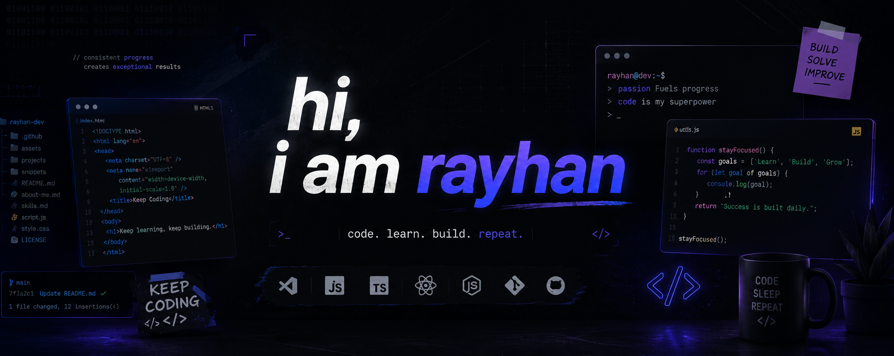

### 🚀 Backend Developer | AI Enthusiast | Open Source Learner

---

## 🧠 About Me

- 🔭 Currently building backend systems and AI-powered projects
- 🌱 Learning more about scalable backend architecture
- 🤖 Interested in AI Assistant, Automation, and Discord Bots
- 💡 Love turning ideas into real working products
- ⚡ Linux enthusiast & late-night builder

---

## 🛠 Tech Stack

### Backend

### Database

### Tools

---

## 🚀 Featured Projects

### 🤖 OpenClaw AI Assistant
AI-powered Discord assistant with smart personality system, backend integration, and psychological interaction support.

### 🌐 Backend API Systems
Building scalable REST APIs using Hono, TypeScript, Prisma, and modern backend architecture.

### 🖼 AI Image Enhancer
Web app concept for enhancing low-quality images into HD using AI models.

---

## 📊 Most Used Languages

<table width="100%">
<tr>
<td width="50%" align="center" valign="middle">

</td>

<td width="50%" align="center" valign="middle">

</td>
</tr>
</table>

---

## 🌍 Connect With Me

---

### “Code. Build. Break. Learn. Repeat.”

